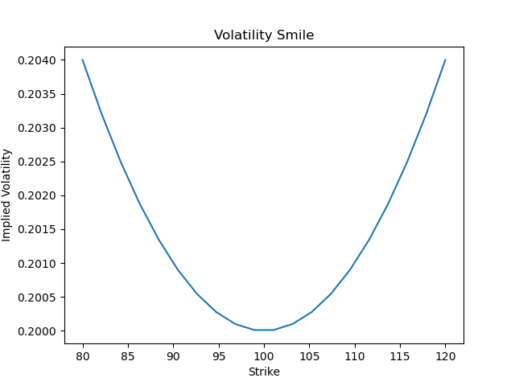
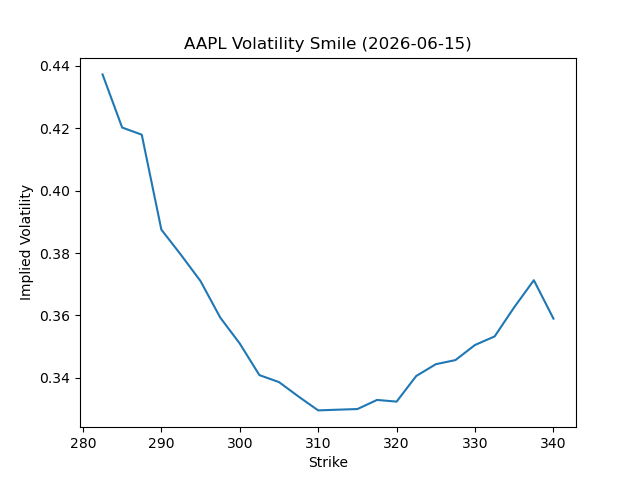
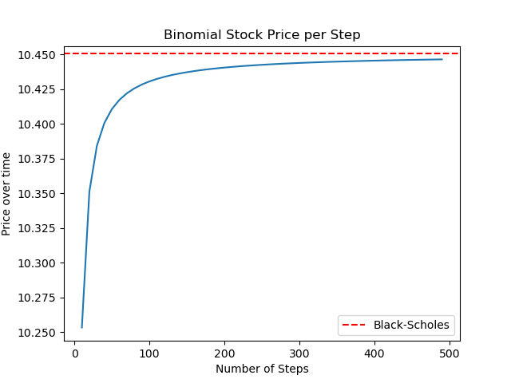
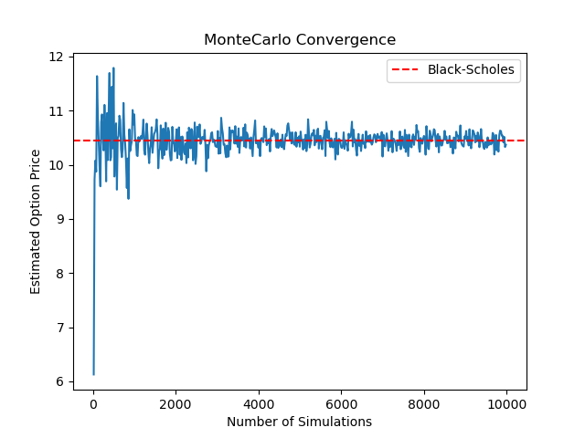

# Option Pricing Library
A Python derivatives pricing library implementing analytical, numerical and simulation based methods for pricing financial options.
Built independently in Python, drawing on stochastic calculus and derivatives pricing theory from my BSc in Statistics, Economics and Finance at UCL.

## Features

The project includes:
* Black-Scholes pricing
* Greeks (Delta, Gamma, Vega, Theta, Rho)
* Implied volatility estimation
* CRR binomial trees
* American option pricing
* Monte Carlo simulation
* Asian options
* Barrier options
* Volatility smile analysis
* Market data integration via yfinance

## Models Implemented

### Black-Scholes
Analytical pricing for European call and put options

Features:
* Price
* Delta
* Gamma
* Vega
* Theta
* Rho
* Implied volatility estimator using Newton-Raphson

### Binomial Tree (CRR)
Cox-Ross-Rubinstein numerical method implementation

Supports:
* European call and put options
* American put (and call) options
* Convergence analysis vs Black-Scholes

### Monte Carlo Simulation
Risk-neutral geometric Brownian motion simulations extended to exotic options

Features:
* European options
* Asian options
* Barrier options
* Antithetic variates for variance reduction
* 95% confidence intervals for European options
* Convergence analysis vs Black-Scholes

### Volatility Smile
Implied volatility extraction and visualisation

Supports:
* Synthetic volatility smiles
* Market option chain analysis using Yahoo Finance data

## Example Output

```text
===Black Scholes===
Call price: 10.4506
Put price: 5.5735

===Greeks===
Call: 
Delta: 0.6368, Gamma: 0.0188, Vega = 0.3752, Theta = -0.0176, Rho = 0.5323
Put: 
Delta: -0.3632, Gamma: 0.0188, Vega = 0.3752, Theta = -0.0045, Rho = -0.4189

===Binomial===
European Call price: 10.4486
European Put price: 5.5715
American Call price: 10.4486
American Put price: 6.0896

===Monte Carlo===
European Call price: 10.5123
European Put price: 5.6305
European Call 95% CI: [10.1220, 10.6936]
European Put 95% CI: [5.3746, 5.7117]
Asian Call price: 5.7348
Asian Put price: 3.3608
Barrier Call price: 8.9177
Barrier Put price: 0.1835

===IV Solver===
Implied Volatility: 0.2000

===Volatility Smile===
Generating volatility smile plots: one synthetic, one from real AAPL market data...
```



```text
===Convergence Plots===
Generating convergence plots for Binomial and Monte Carlo...
```




## Numerical Methods

### Newton-Raphson
The implied volatility solver uses Newton-Raphson root finding to solve:

C(sigma) = C_market

The update rule is:

$$\sigma_{n+1} = \sigma_n - \frac{C(\sigma_n) - C_{market}}{\text{Vega}(\sigma_n)}$$

Safety features include:

- Arbitrage bound validation
- Vega near-zero protection
- Invalid volatility detection
- Maximum iteration limit
- State restoration via `finally` block

### Backward Induction (Binomial Tree)
At each node, the option value is the discounted expected value under the risk-neutral measure:

$$V_t = e^{-r\Delta t}[pV_{t+1,u} + (1-p)V_{t+1,d}]$$

For American options, early exercise is checked at each node:

$$V_t = \max(V_{continuation}, V_{intrinsic})$$

Where intrinsic value is max(S-K, 0) for calls and max(K-S, 0) for puts.

### Monte Carlo (GBM)
Stock paths are simulated under the risk-neutral measure using the discretised GBM:

$$S_{t+\Delta t} = S_t \exp\left[\left(r - \frac{\sigma^2}{2}\right)\Delta t + \sigma\sqrt{\Delta t}\,\varepsilon\right]$$

where $\varepsilon \sim N(0,1)$.

Variance is reduced using antithetic variates — each random draw $\varepsilon$ is paired with $-\varepsilon$, halving the number of simulations required for a given accuracy.

## File Structure
```text
options-pricing-library/
│
├── option_contract.py
│   └── Dataclass representing an option contract and input validation.
│
├── black_scholes.py
│   └── Analytical European option pricing, Greeks, and implied volatility solver.
│
├── binomial.py
│   └── Cox-Ross-Rubinstein lattice implementation for European and American options.
│
├── monte_carlo.py
│   └── Risk-neutral Monte Carlo simulation with antithetic variates and confidence intervals.
│
├── vol_smile.py
│   └── Synthetic and market-implied volatility smile visualisation.
│
├── main.py
│   └── Example usage, model comparison, and convergence analysis.
│
└── README.md
```
## Validation

European option prices were validated against analytical Black-Scholes solutions.

Binomial tree prices converge toward Black-Scholes values as the number of steps increases.

Monte Carlo estimates converge toward analytical prices with increasing simulation counts.

## Technologies

- Python
- NumPy
- SciPy
- Matplotlib
- yfinance

## Installation

```bash
pip install numpy scipy matplotlib yfinance
```